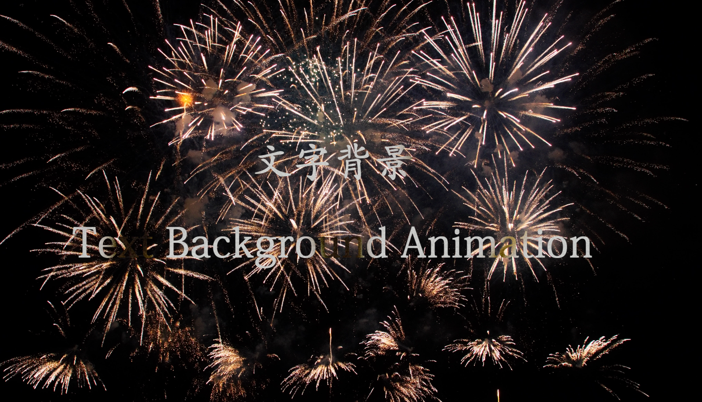
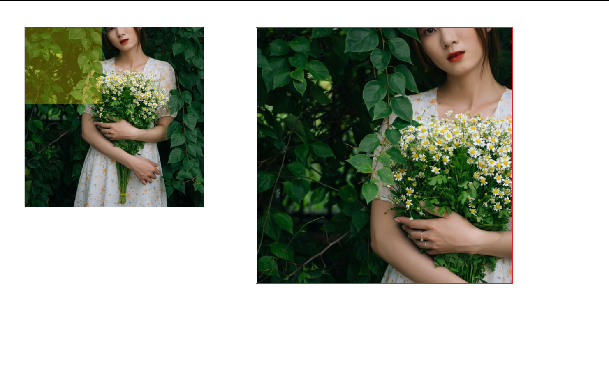
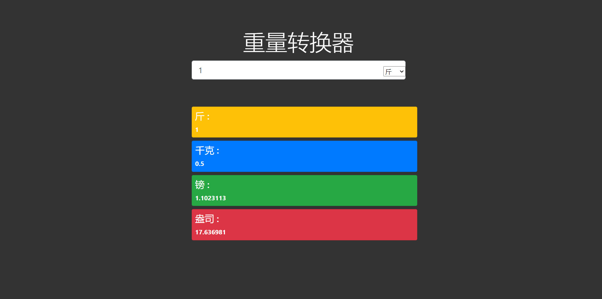

# CSS And JacaScript Demo

## 文本背景

## 实现文本背景步骤

1. 设置文本背景图片
2. 将文本颜色设置为透明
3. 对文本背景图片进行裁剪
4. 设置背景图片移动动画

### 文本背景代码

```javascript
1. 设置文本背景图片
    background:url('xxxx');
2. 将文本颜色设置为透明
    color:transparent;
3. 对文本背景图片进行裁剪(考虑兼容性)
    background-clip:text;
    -webkit-background-clip:text;
4. 设置背景图片移动动画(考虑兼容性)    
    animation:move 60s linear infinete;
    -webkit-animation:move 60s linear infinete;
```

### 文本背景效果图



## 放大镜

### 实现放大镜步骤

1. 设置遮罩层
    - 鼠标移入 遮罩层和大图盒子显示
    - 鼠标移出 遮罩层和大图盒子隐藏
2. 遮罩层跟随盒子一起移动
    - 计算鼠标在盒子内部的位置  = 鼠标在页面的位置 - 盒子的水平位置
    - 计算遮罩层在x y上的移动距离
        - 移动距离 = 鼠标位置 - 盒子自身宽/高度的一半
    - 计算遮罩层最大的移动距离
3. 通过求得的遮罩层在x y上的移动距离判断是否会出界
4. 将获得的移动距离赋值给遮盖层
5. 按照比例计算右侧大图的移动距离
    - 计算公式(x y的计算方式一致)
    - maskX / maskMaxX = BigX / BigMax
    - BigMax = BigImg.offsetWidth - Big.offsetWidth

`大图和小图的移动方向相反 最后设置需要加负号`
`大图的尺寸和容器大小不一致 但是大图和小图尺寸保持一定比例`

### 放大镜代码

```javascript
window.addEventListener('load',()=>{

    1. 设置遮罩层(mask)
        - 鼠标移入 遮罩层和大图盒子显示
    mask.addEventListener('mouseover',function(){
        xxx.style.display = 'block'
    });
        - 鼠标移出 遮罩层和大图盒子隐藏
    mask.addEventListener('mouseleave',function(){
        xxx.style.display = 'none'
    });

    2. 遮罩层(mask)跟随盒子(box)一起移动
    box.addEventListener('mousemove',e=>{
        - 计算鼠标在盒子内部的位置  = 鼠标在页面的位置 - 盒子的水平位置
        var x = e.pageX - this.offsetLeft;
        var y = e.pageY - this.offsetTop;

        - 计算遮罩层在x y上的移动距离
        - 移动距离 = 鼠标位置 - 盒子自身宽/高度的一半
        var maskX = x - mask.offsetLeft / 2;
        var maskY = y - mask.offsetTop / 2;

        - 计算遮罩层最大的移动距离
        maskMaxX = box.offsetWidth - mask.offsetWidth ;
        maskMaxY = box.offsetHeight - mask.offsetHeight ;

    3. 通过求得的遮罩层在x y上的移动距离判断是否会出界
        if(maskX <= 0 ){
            maskX = 0;
        }else if(maskX > maskMaxX){
            maskX = maskMaxX ;
        }
        
        if(maskY <= 0 ){
            maskY = 0;
        }else if(maskY > maskMaxY){
            maskY = maskMaxY
        }
    4. 将获得的移动距离赋值给遮盖层
        mask.style.left = maskX;
        mask.style.top = maskY;

    5. 按照比例计算右侧大图的移动距离 并赋值
    BigMaxX = BigImg.offsetWidth - Big.offsetWidth ;
    BigMaxY = BigImg.offsetHeight - Big.offsetHeight ;
    BigX = maskX * BigMaxX / maskMaxX ;
    BigY = maskY * BigMaxY / maskMaxY;

    BigImg.style.left = -BigX + 'px';
    BigImg.style.top = -BigY + 'px';

    });
})
```

### 放大镜效果图



## 过滤列表

### 步骤

- 获取输入框DOM
- 添加event listener
  - DOM.addEventListener('keyup',functionnName);
- 具体函数实现
  - 获得输入框输入的值
  - 获得设置的 ul 和 li
  - 获得所有列表内的值
    - 遍历获得包含数据的 a
    - 对输入框输入的值和列表内的值进行比较

#### 使用materialize搭建 ( html + css 部分)

```html
    <div class="container">
        <h1>过滤列表</h1>
        <div class="filteInput">
            <input type="text" placeholder="输入内容" id="filterInput">
        </div>
         <ul id="names" class="collection with-header">
            <li class="collection-header">
                <h5>A</h5>
            </li>
            <li class="collection-item">
                <a href="#">Amalia</a>
            </li>
            <li class="collection-item">
                <a href="#">Ajax</a>
            </li>
            <li class="collection-item">
                <a href="#">Adolph</a>
            </li>
            <li class="collection-item">
                <a href="#">Ambrosias</a>
            </li>

            <!-- 后面设置结构一致 修改名字即可 -->
        </ul>
    </div> 
```

#### JS部分

```javascript
    - 获取输入框DOM
    var filterInput = document.getElementById('filterInput');

    - 添加event listener
    filterInput.addEventListener('keyup',functionnName);
    
    - 具体函数实现
        - 获得输入框输入的值 并全部转换为大写
        let vals = filterInput.value.toUpperCase();
        
        - 获得设置的 ul 和 li
        let ul = document.querySelector('ul);
        let li = ul.querySelectorAll('li');
        
        - 获得所有列表内的值
            - 遍历获得包含数据的 a 第 i 个 li下的 a[0] 的值
            for(let i = 0; i < li.length; i++ ){
                var a = li[i].getElementByTagName('a').[0];
            - 对输入框输入的值和列表内的值进行比较
            if (a.innerHTML.toUpperCase().indexOf(val) > -1) {
                li[i].style.display = 'block';
            } else {
                li[i].style.display = 'none';
            }
        }
```

## 重量转换器

### 使用Bootstrap搭建


#### 重量转换器JS部分

```javascript
// Get Input
const ipt = document.getElementById('jinInput');
// 设置刚开始输出部分为不可见
var output = document.getElementById('output').style.visibility = "hidden";

ipt.addEventListener('input', function (e) {
    // 获取输入框的输入值
    var iptVal = e.target.value;
    var output = document.getElementById('output').style.visibility = "visible";

    // 斤转换
    document.getElementById('jinOutput').innerHTML = iptVal;
    document.getElementById('kgOutput').innerHTML = iptVal * 0.5;
    document.getElementById('poundOutput').innerHTML = iptVal * 1.1023113;
    document.getElementById('ozOutput').innerHTML = iptVal * 17.636981;
)}
```

### 重量转换器效果图



## 补充

- 获得select下option的值
  - 获得select
    - var select = document.querySelector('select');
    - 获得选定选项的索引值
      - var index = select.selectedIndex;
    - 获得value
      - select.option[index].value
    - 获得text
      - select.option[index].text
    - 其他的
      - select.option[index].getAttribute('xxx');
